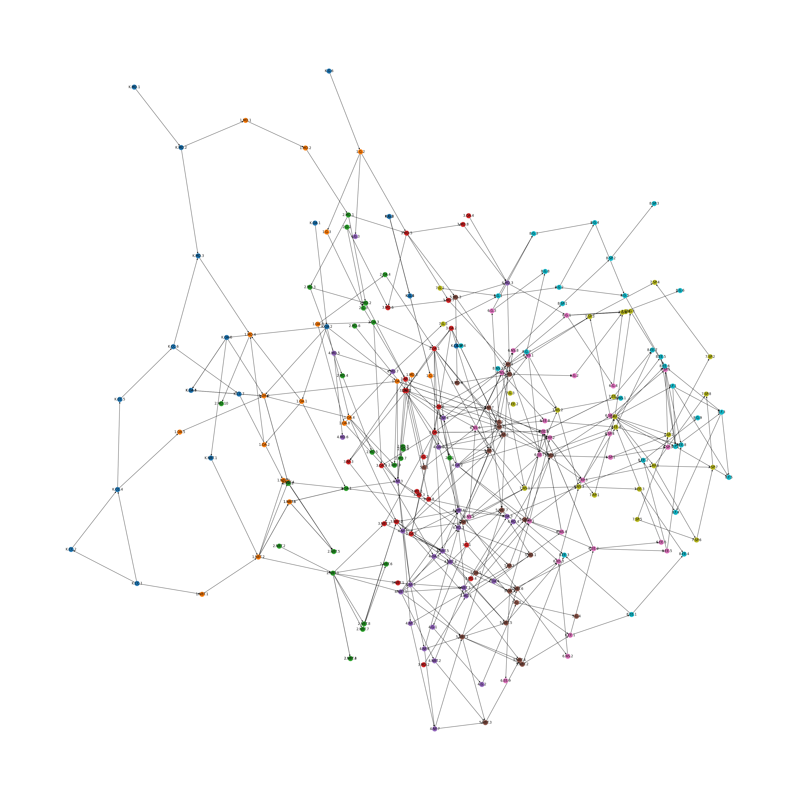

# CCSS
Common Core State Standards Analysis

Cross-referenced (inconsistently) from https://tools.achievethecore.org/coherence-map/ and https://achievethecore.org/page/844/a-graph-of-the-content-standards. Overall, I felt that substandard relationships were handled inconsistently in the reference graph, which I suppose is why they were omitted entirely in the Coherence Map, so in the end I decided to ignore them as well. I ignored "related standards" focussing only on the precedence relationships. I also ignored clusters, as at first they seemed like an arbitrary chronological ordering, but now that I see that they have some content, I might add them. I also excluded the high school standards except as successors to K-8 standards, but may include them in the future. There may still be some errors, but including both "to" and "from" entries served as a good check.

I ran a couple of visualization libraries on the final graph. My best results so far:

